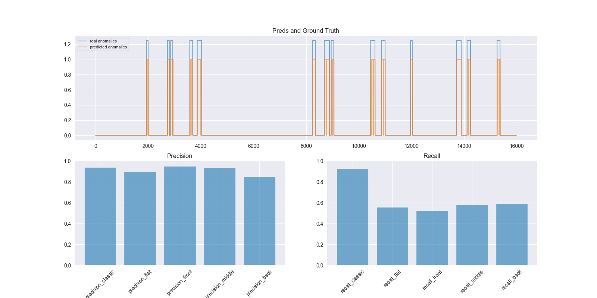

# Precision and Recall for Time Series

[](https://opensource.org/licenses/Apache-2.0)

[](https://badge.fury.io/py/prts)

Unofficial python implementation of [Precision and Recall for Time Series](https://papers.nips.cc/paper/2018/file/8f468c873a32bb0619eaeb2050ba45d1-Paper.pdf).

>Classical anomaly detection is principally concerned with point-based anomalies, those anomalies that occur at a single point in time. Yet, many real-world anomalies are range-based, meaning they occur over a period of time. Motivated by this observation, we present a new mathematical model to evaluate the accuracy of time series classification algorithms. Our model expands the well-known Precision and Recall metrics to measure ranges, while simultaneously enabling customization support for domain-specific preferences.

This is the open source software released by [Computational Mathematics Laboratory](https://sites.google.com/view/compml/). It is available for download on [PyPI](https://pypi.org/project/prts/).

## Installation


### PyPI

PRTS is on [PyPI](https://pypi.org/project/prts/), so you can use pip to install it.

```bash
$ pip install prts
```

### from github
You can also use the following command to install.

```bash
$ git clone https://github.com/CompML/PRTS.git
$ cd PRTS
$ make install  # (or make develop)
```

## Usage

```python
from prts import ts_precision, ts_recall


# calculate time series precision score
precision_flat = ts_precision(real, pred, alpha=0.0, cardinality="reciprocal", bias="flat")
precision_front = ts_precision(real, pred, alpha=0.0, cardinality="reciprocal", bias="front")
precision_middle = ts_precision(real, pred, alpha=0.0, cardinality="reciprocal", bias="middle")
precision_back = ts_precision(real, pred, alpha=0.0, cardinality="reciprocal", bias="back")
print("precision_flat=", precision_flat)
print("precision_front=", precision_front)
print("precision_middle=", precision_middle)
print("precision_back=", precision_back)

# calculate time series recall score
recall_flat = ts_recall(real, pred, alpha=0.0, cardinality="reciprocal", bias="flat")
recall_front = ts_recall(real, pred, alpha=0.0, cardinality="reciprocal", bias="front")
recall_middle = ts_recall(real, pred, alpha=0.0, cardinality="reciprocal", bias="middle")
recall_back = ts_recall(real, pred, alpha=0.0, cardinality="reciprocal", bias="back")
print("recall_flat=", recall_flat)
print("recall_front=", recall_front)
print("recall_middle=", recall_middle)
print("recall_back=", recall_back)
```

### Parameters

| Parameter   | Description                                                          | Type   |
|-------------|----------------------------------------------------------------------|--------|
| alpha       | Relative importance of existence reward (0 ≤ alpha ≤ 1).             | float  |
| cardinality | Cardinality type. This should be "one", "reciprocal" or "udf_gamma"  | string |
| bias        | Positional bias. This should be "flat", "front", "middle", or "back" | string |

## Examples

We provide a simple example code.
By the following command you can run the example code for the toy dataset and visualize the metrics.

```bash
$ python3 examples/precision_recall_for_time_series.py
```



## Tests

You can run all the test codes as follows:

```bash
$ make test
```

## References
* Tatbul, Nesime, Tae Jun Lee, Stan Zdonik, Mejbah Alam, and Justin Gottschlich. 2018. “Precision and Recall for Time Series.” In Advances in Neural Information Processing Systems, edited by S. Bengio, H. Wallach, H. Larochelle, K. Grauman, N. Cesa-Bianchi, and R. Garnett, 31:1920–30. Curran Associates, Inc.

## LICENSE
This repository is Apache-style licensed, as found in the [LICENSE file](LICENSE).

## Citation

```bibtex
@software{https://doi.org/10.5281/zenodo.4428056,
  doi = {10.5281/ZENODO.4428056},
  url = {https://zenodo.org/record/4428056},
  author = {Ryohei Izawa, Ryosuke Sato, Masanari Kimura},
  title = {PRTS: Python Library for Time Series Metrics},
  publisher = {Zenodo},
  year = {2021},
  copyright = {Open Access}
}

```
